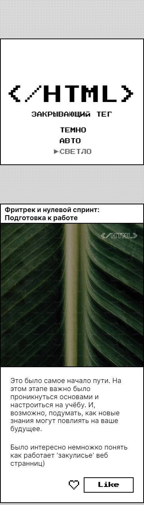
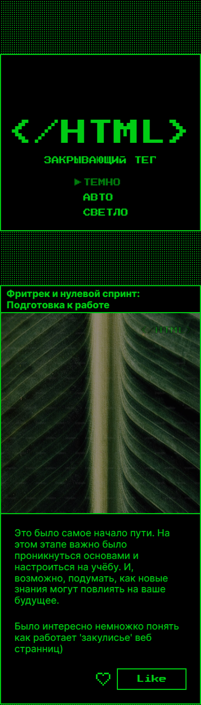
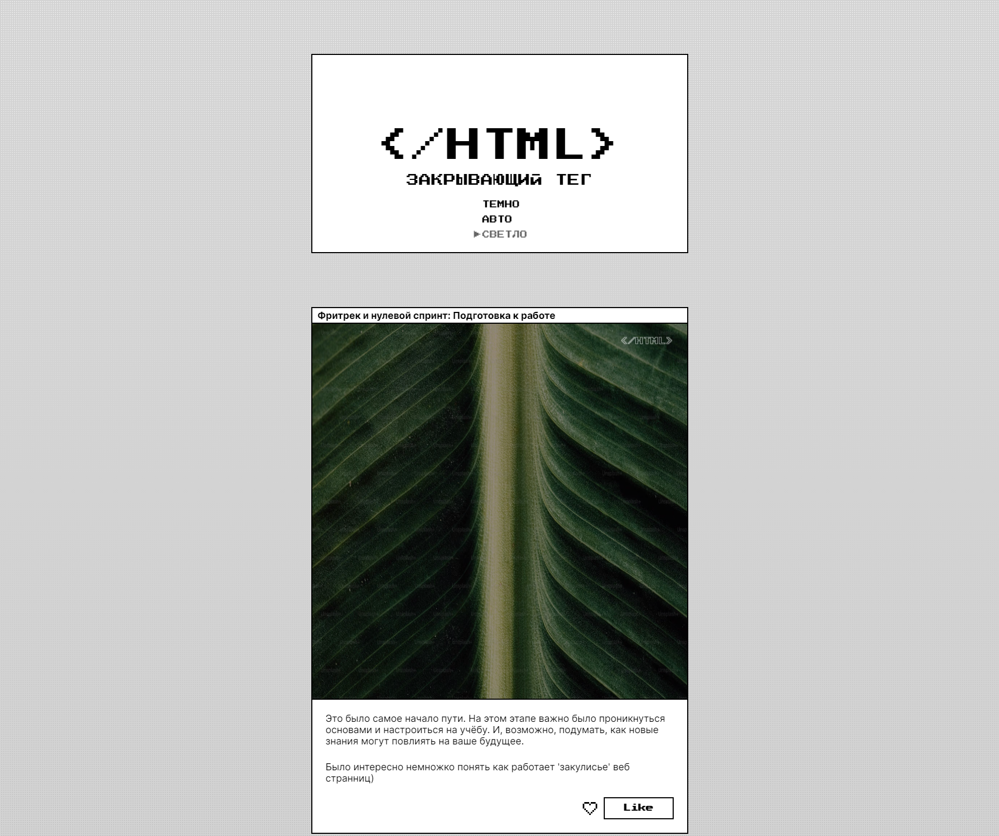
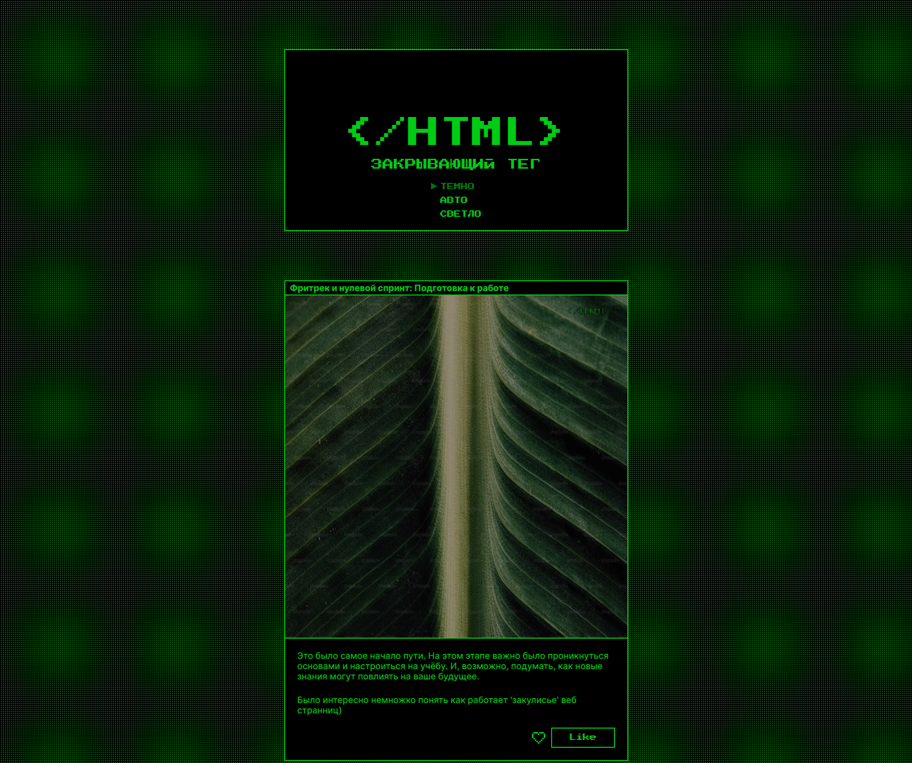

https://github.com/RiconCla/zakrivayuschiy-teg-f.git
# Работа "Закрывающий тег"

## Оглавление

- [Запуск](#запуск)
- [Скриншоты](#скриншоты)
- [Описание](#описание)
- [Благодарность](#благодарность)

### Запуск

```bash
npm i
gulp pug
npm run dev
```
### Скриншоты






### Описание

Проект о рефлекции пройденого пути со старта изучения веб-разработки. В данной работе реализован адаптивный дизайн. Также реализованы Темная/Светлая и Авто(которая выбирает цветовую схему в заивимости от настроек ОС пользователя) темы.
Реализованы анимации кнопок (сердце и like), с применением анимации svg. Использованы различные фильтры для картинок.
Сверстана работа с помощью PUG, в качестве сборщика использован GULP.

Использованные технологии: HTML, CSS, FLEX, BEM, Responsive, MEADIA QUERIES, JS, SVG, Animation, PUG, GULP, NPM 
